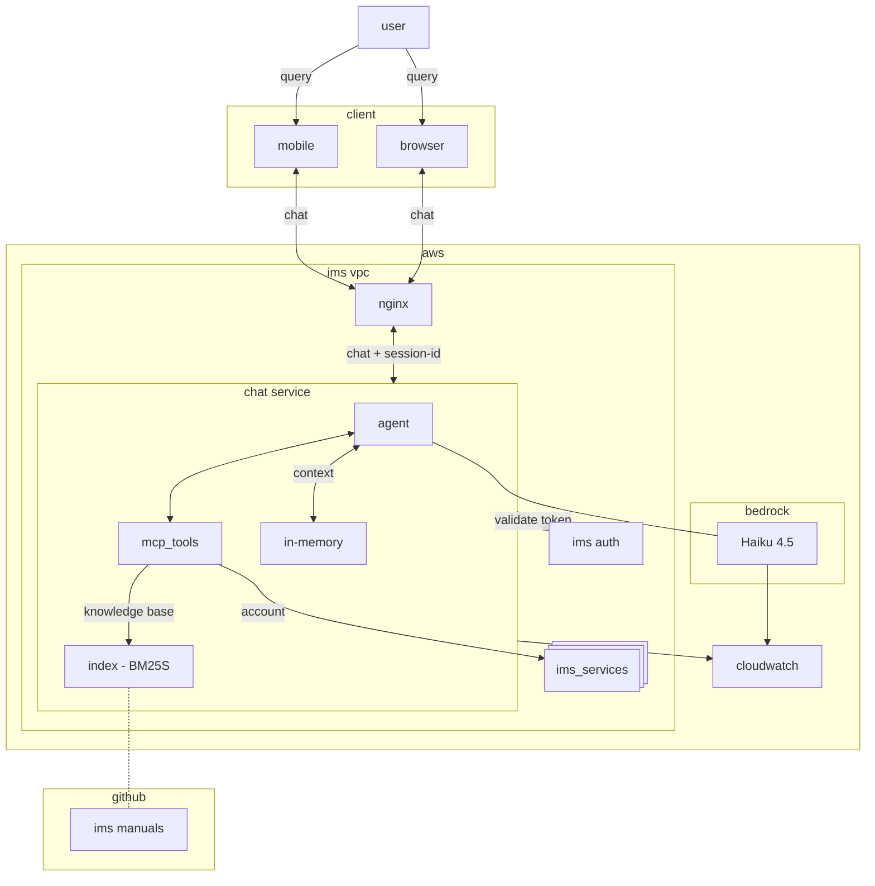
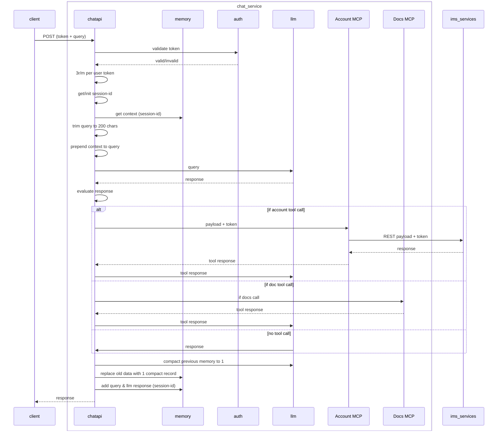
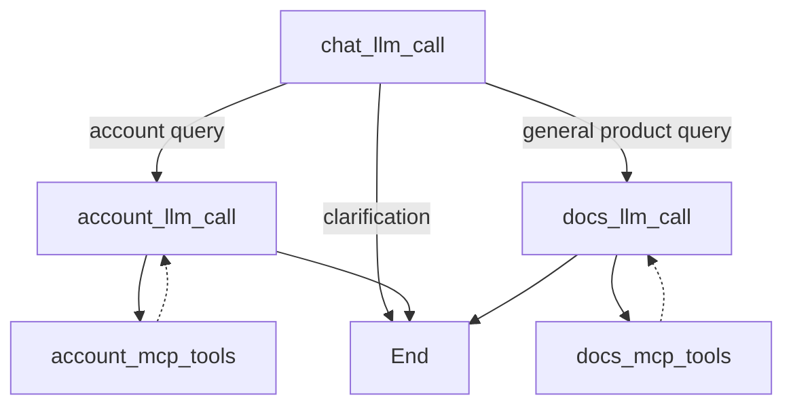
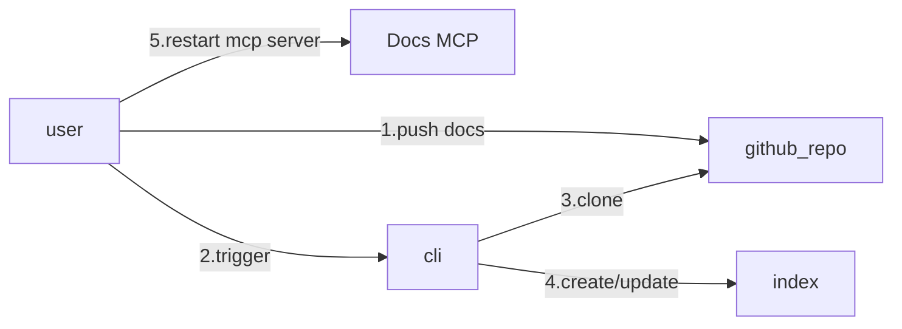

## Highlevel System Architecture

```mermaid
flowchart TD
subgraph client
    mobile
    browser
end
subgraph cloud [aws]
subgraph vpc [ims vpc]
    subgraph webapp ["chat service"]
        agent[agent]
        mcp_tools
        memory[in-memory]
        docs_idx["index - BM25S"]
    end
    auth[ims auth]
    ims_services@{shape: processes}
    nginx
end
subgraph bedrock
llm["Haiku 4.5"]
end
logging["cloudwatch"]
end
subgraph github
docs["ims manuals"]
end

user --> |query| mobile
user --> |query| browser
mobile <--> |chat| nginx
browser <--> |chat| nginx
nginx <--> |chat + session-id| webapp
agent --- llm
agent <--> mcp_tools
agent <--> |context|memory
webapp --> |validate token|auth
webapp --> logging
llm --> logging
mcp_tools --> |account| ims_services
mcp_tools --> |knowledge base|docs_idx -.- docs
```

## Chat Service Flow

```mermaid
sequenceDiagram
participant client
box chat_service
participant chatapi
participant memory
participant auth
participant llm
participant account_tools as Account MCP
participant doc_tools as Docs MCP
end
participant ims_services
client ->> chatapi: POST (token + query)
chatapi ->> auth: validate token
auth -->> chatapi: valid/invalid
chatapi ->> chatapi: 3r/m per user token
chatapi ->> chatapi: get/init session-id
chatapi ->> memory: get context (session-id)
chatapi ->> chatapi: trim query to 200 chars
chatapi ->> chatapi: prepend context to query
chatapi ->> llm: query
llm -->> chatapi: response
chatapi ->> chatapi: evaluate response
alt if account tool call
chatapi ->> account_tools: payload + token
account_tools ->> ims_services: REST payload + token
ims_services -->> account_tools: response
account_tools -->> chatapi: tool response
chatapi ->> llm: tool response
else if doc tool call
chatapi ->> doc_tools: if docs call
doc_tools -->> chatapi: tool response
chatapi ->> llm: tool response
else no tool call
llm ->> chatapi: response
end
chatapi ->> llm: compact previous memory to 1
chatapi ->> memory: replace old data with 1 compact record
chatapi ->> memory: add query & llm response (session-id)
chatapi -->> client: response
```

## Agent Workflow

```mermaid
flowchart TD
chat_llm_call
account_llm_call
docs_llm_call
account_mcp_tools
docs_mcp_tools
End
chat_llm_call -->|account query| account_llm_call
chat_llm_call --> |general product query|docs_llm_call
chat_llm_call --> |clarification|End
account_llm_call --> account_mcp_tools
account_mcp_tools -.-> account_llm_call
docs_llm_call --> docs_mcp_tools
docs_mcp_tools -.-> docs_llm_call
account_llm_call --> End
docs_llm_call --> End
```

## General Docs/Manuals update lifecycle

```mermaid
flowchart LR
doc_tools["Docs MCP"]
user --> |1.push docs| github_repo
user -->|2.trigger|cli
cli --> |3.clone|github_repo
cli --> |4.create/update| index
user --> |5.restart mcp server| doc_tools
```