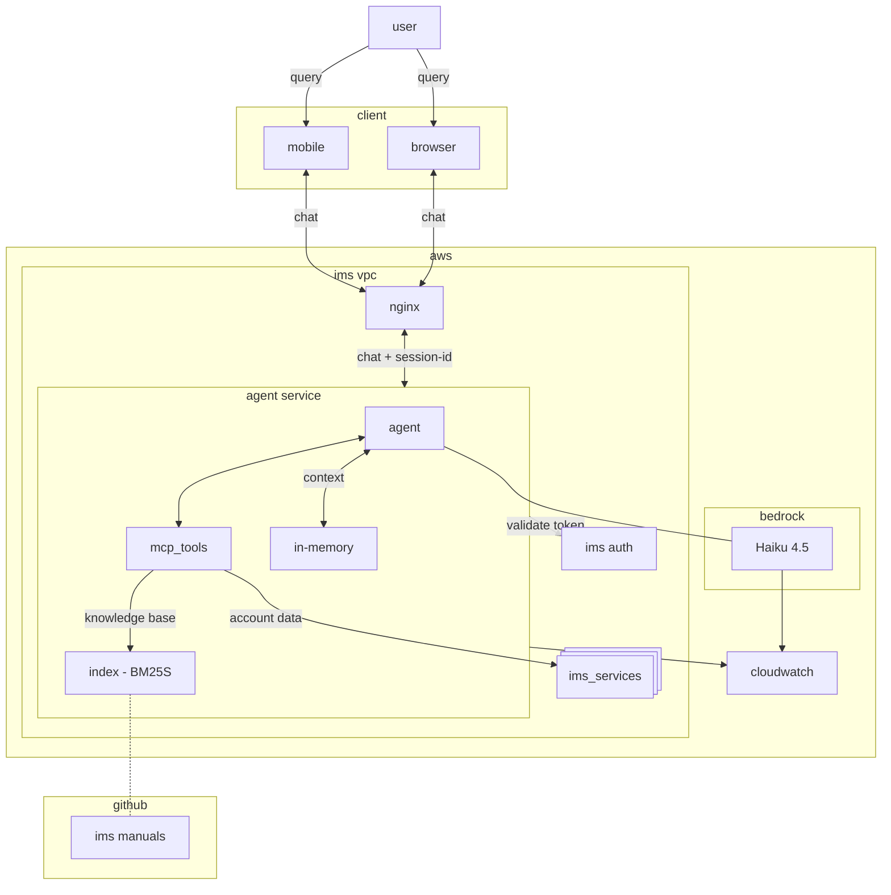

## Highlevel Architecture

```mermaid
flowchart TD
subgraph client
    mobile
    browser
end
subgraph cloud [aws]
subgraph vpc [ims vpc]
    subgraph webapp ["agent service"]
        agent[agent]
        mcp_tools
        memory[in-memory]
        docs_idx["index - BM25S"]
    end
    auth[ims auth]
    ims_services@{shape: processes}
    nginx
end
subgraph bedrock
llm["Haiku 4.5"]
end
logging["cloudwatch"]
end
subgraph github
docs["ims manuals"]
end

user --> |query| mobile
user --> |query| browser
mobile <--> |chat| nginx
browser <--> |chat| nginx
nginx <--> |chat + session-id| webapp
agent --- llm
agent <--> mcp_tools
agent <--> |context|memory
webapp --> |validate token|auth
webapp --> logging
llm --> logging
mcp_tools --> |account data| ims_services
mcp_tools --> |knowledge base|docs_idx -.- docs
```